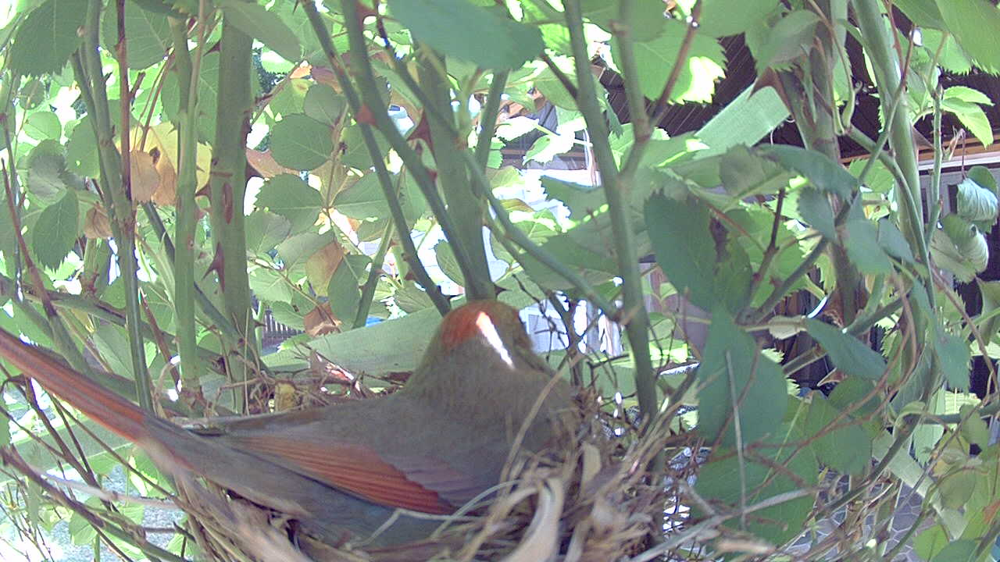
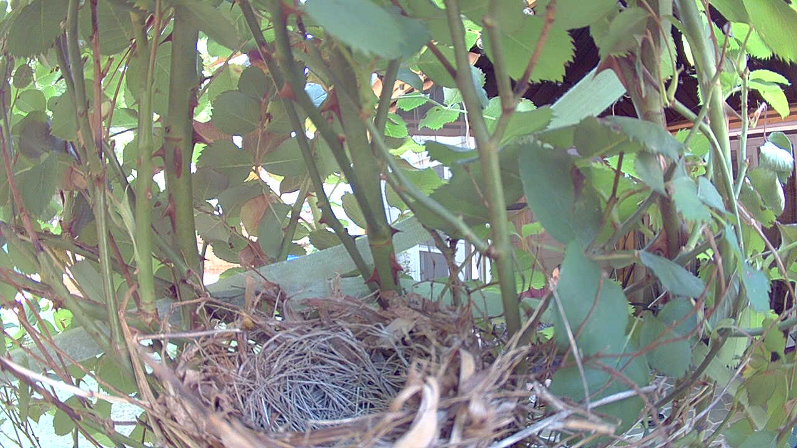

# Birdnest AI

A profile-driven AI nest monitor for open-cup nesting passerines. Adaptive snap cadence, two-model species ID with blind verification, lifecycle tracking from egg-laying through fledge, Discord alerts on five channels.

New species profiles drop in as TOML — see [`src/birdnest_ai/species/README.md`](src/birdnest_ai/species/README.md) for the authoring guide.

---

## What this is

A static camera (Blink Outdoor) points at an open-cup nest. Every fresh snap goes through Claude Sonnet 4.6 for structured analysis: is the attending parent present, are eggs visible, is anything threatening near the nest, are chicks visible, is there a feeding event. The result drives a rules engine that decides whether to fire a Discord alert, whether to advance the lifecycle stage, and whether the threat warrants a blind second opinion from Claude Opus 4.7.

The system is tuned around three properties that matter for protecting an active nest:

- **Reaction time scales with risk.** When the attending parent is on the nest, a five-minute snap interval is enough. When the parent leaves to forage, the interval drops to one minute. For the first three minutes of any absence — the highest-risk window for a fast in-and-out predator — it tightens to thirty seconds.
- **The pipeline is split for resilience.** A downloader process and an analyzer process run as independent macOS LaunchAgents and coordinate through an atomic-rename spool on disk. The downloader never stops capturing snaps, even when the analyzer crashes, restarts, or runs out of API credits. When the analyzer comes back, it drains whatever piled up.
- **Threat alerts get a second look.** CRITICAL and HIGH alerts trigger a blind Opus 4.7 verification pass — same image, same prompt, no hint of what Sonnet said. Opus can suppress, downgrade, or confirm.

---

## Profiles

A species profile is a single TOML file. The runtime loads one profile at startup (selected via `SPECIES_PROFILE_PATH`) and treats it as immutable for the process lifetime. Two profiles ship with the package:

| Profile | Status |
|---|---|
| `northern_cardinal` | Tuned reference deployment. The original cardinal-only system; alert copy, field marks, and lifecycle thresholds are byte-identical to the pre-genericization runtime. |
| `american_robin` | Structural proof profile. Different threat list (American Crow, Cooper's Hawk, raccoon), different attending-parent label, different lifecycle timing. Reference assets aren't yet collected — using this profile in production requires populating habitat/camera strings and reference images. |

The profile drives every species-specific decision the analyzer, prefilter, rules engine, state machine, lifecycle predictor, notifier, and verifier make. Generic Python; species-specific TOML.

---

## What the system sees

Each snap goes to Claude Sonnet 4.6 as three crops of the same frame: the full view, a tight center crop on the nest cup, and a smaller overview for scene context. The model returns a structured observation that drives all downstream decisions.

### Attending parent on nest



*The system notes presence, confirms it, and checks back in five minutes. No alert. This is the default outcome, repeated hundreds of times a day. (Cardinal profile, April 2026.)*

### Something is at the nest


*A non-target species at or near the nest. The system identifies it from per-threat field marks declared in the active profile. CRITICAL or HIGH alerts trigger blind Opus verification before they fire. (Cardinal profile — the threat is a Brown Thrasher, the canonical predator the cardinal profile was tuned against.)*

### Empty cup



*The attending parent is away. The system tightens the snap cadence — first 30 seconds for the burst window, then 60 seconds — and watches for a threat or a return.*

---

## Severity levels

| Level | What the analyzer saw | What the system does |
|---|---|---|
| **CRITICAL** | A non-target beak or body inside the nest cup | Blind Opus verification, then page the urgent channel |
| **HIGH** | A threat species near the nest | Blind Opus verification, then alert |
| **MEDIUM** | Attending parent away from nest for 5+ minutes | Alert with a bucketed elapsed-minutes label |
| **LOW** | Attending parent returned, or a lifecycle transition | Quiet notification, never an alarm |

User-facing alert text comes from `profile.alert_copy` — the cardinal profile reads "Mother away from nest for 5+ minutes"; the robin profile reads "Parent away from nest for 5+ minutes".

---

## How it works

Two services running on a host that stays on. The first one captures snaps; the second one analyzes them. They are decoupled on purpose. A stuck Anthropic API call in April 2026 froze a single combined process for three hours during peak daylight before the split. Splitting them means the camera never stops, even if the analysis side hangs, restarts, or runs out of credits.

```
┌──────────────────────────────┐
│  DOWNLOADER                  │
│                              │
│  Blink camera                │
│  Adaptive cadence:           │
│    30s / 1m / 5m / 30m       │
│                              │
│  Never stops. Not even       │
│  during code deploys.        │
└──────────────────────────────┘
               │
         spool on disk
               ↓
┌──────────────────────────────┐
│  ANALYZER                    │
│                              │
│  Claude Sonnet 4.6           │
│    species ID + threat eval  │
│  Opus 4.7 verification       │
│  Discord alerts              │
│  feed + analytics            │
│                              │
│  Can restart without         │
│  losing a single snap.       │
└──────────────────────────────┘
```

The cadence adapts to the situation. When the attending parent is on the nest, a photo every five minutes is enough. When the parent is away foraging, the interval drops to sixty seconds. Overnight, when the parent broods through the dark, it relaxes to every thirty minutes.

### The night vision problem

The Blink camera switches to infrared after dark. The images go grayscale, and a brown-plumaged passerine becomes nearly indistinguishable from nest straw or mud. Early on the analyzer kept reporting "nest empty" at moderate confidence on IR frames where the attending parent was clearly there.

The fix has three parts. First, explicit IR guidance in the analyzer prompt: when the image is grayscale, default to "uncertain" rather than "absent". Second, suppress absence alerts during quiet hours, when an attending parent leaving the nest at 2 AM is not a real scenario. Third, raise the confidence floor for overnight state changes, so a low-confidence IR misread cannot trigger the cadence to tighten and burn camera battery for nothing.

The wall-clock quiet-hours window starts later than the camera's IR transition at sunset, leaving a gap where IR is on but quiet-hours suppression is not. The system compensates by also keying the suppression off the model's own description: when Sonnet says "IR mode" or "infrared" or "grayscale" in its summary, the system treats the frame the same way it treats the middle of the night. Predator alerts still fire overnight — a raccoon at the nest at 3 AM is real.

### Catching a four-second attack

A brown-thrasher raid takes about four seconds. Beak in the cup, grab, gone. A sixty-second snap cadence can miss the entire event between frames.

Two changes compound to close that gap.

**Burst cadence.** For the first three minutes after the attending parent leaves the nest, the system snaps every thirty seconds instead of sixty. After the burst window the cadence relaxes back to one-minute absence cadence.

```
Before:   leave ── 60s ── 60s ── 60s ── 60s ── 60s ── 60s ── return
After:    leave ─30s─30s─30s─30s─30s─30s ── 60s ── 60s ── 60s ── return
          │──── burst (first 3 min) ────│──── normal absence ────│
```

**Multi-image analysis.** Each snap is sent as three crops — full, tight center on the cup, and overview. The analyzer gets more chances to see a partial body half-hidden by foliage and more pixels per chance.

### Tracking the lifecycle

The system tracks six stages: building, egg-laying, incubation, feeding, fledging, empty. Transitions are inferred from observation history, not declared by hand:

- **Building → laying** on the first confident attending-parent-on-nest observation.
- **Laying → incubation** when a 24-hour rolling window shows ≥70% on-nest confident observations (cardinal profile threshold; tunable per profile).
- **Incubation → feeding** with a 2-sighting confirmation rule. A single chick sighting is not enough — a noisy frame should not advance the calendar. Two confirming `young_visible="true"` observations within four hours triggers the transition and fires the 🐣 hatch alert. Cost: a few minutes of latency on real hatch announcements; benefit: no false hatch alerts.
- **Feeding → fledging** after twelve hours with no parent visit and no threat in the previous forty-eight, with chicks previously confirmed.
- **Fledging → empty** after seventy-two hours of no activity.

Each transition fires a quiet LOW alert on a dedicated lifecycle channel, separate from threat alerts. The daily heartbeat embed includes a day counter — "Incubation, Day 4 of about 12" — that keys off the profile's biological day-range.

A backfill tool (`tools/lifecycle_backfill.py`) walks the observation history and infers when each transition happened, so a deployment installed mid-cycle starts the day counter from a real date rather than from the camera-install date.

### Two model verification

Sonnet 4.6 analyzes every snap. CRITICAL and HIGH alerts run a blind Opus 4.7 verification: same image, same prompt, no hint of Sonnet's verdict. Opus can suppress, downgrade, or confirm.

The verifier also runs a content-aware override: if Opus's observation identifies the target species (matching `profile.target.match_terms`) and lists no threats, the alert is suppressed regardless of Opus's rule-engine output. This closes a failure mode where Opus correctly identifies the attending parent but flags `direct_nest_interaction=true` (a schema violation for the target species), which would otherwise produce a CRITICAL-rank rule output that confirms a false Sonnet HIGH through pure severity comparison.

### Five Discord channels

| Channel | Purpose |
|---|---|
| `#alerts` | CRITICAL, HIGH, MEDIUM, LOW. Actionable, live alerts only |
| `#nest-feed` | Every snap with the analyzer's full text. Watch the AI reason in real time |
| `#nest-analytics` | Behavior reports every 8 hours: foraging trips, threat counts, time on nest |
| `#nest-backfill` | Alerts from analyzer downtime, tagged `[BACKFILL +Nm]`. Keeps `#alerts` clean |
| `#lifecycle-changes` | Stage transitions only: laying begins, incubation begins, hatch, fledge. Celebration only, never an alarm |

---

## Setup

### Prerequisites

- macOS with Python 3.11+
- [Blink Outdoor](https://blinkforhome.com/) camera pointed at the nest
- [Anthropic API key](https://console.anthropic.com/) with Sonnet 4.6 + Opus 4.7 access
- Discord server with webhook URLs for up to five channels (alerts is required, the other four are optional). One additional webhook for a dedicated test channel if you plan to run the integration suite

### Install

```bash
git clone https://github.com/bali0019/birdnest-ai.git
cd birdnest-ai
python3.11 -m venv venv
source venv/bin/activate
pip install -e ".[dev]"
```

### Configure

```bash
cp .env.example .env
# Fill in: ANTHROPIC_API_KEY, DISCORD_WEBHOOK_URL, BLINK_USERNAME,
# BLINK_PASSWORD, BLINK_CAMERA_NAME, SPECIES_PROFILE_PATH (defaults to
# the bundled northern_cardinal profile). Optional: feed, analytics,
# backfill, and lifecycle webhook URLs.
```

### Blink authentication (one time)

```bash
python -m birdnest_ai --auth-only
# Check email for the 2FA PIN, enter it when prompted.
# Saves blink_credentials.json. No re-auth needed until token expires (~yearly).
```

### Deploy

```bash
mkdir -p ~/Library/Logs/birdnest-ai

# Install and start both services
cp launchd/com.birdnest.downloader.plist ~/Library/LaunchAgents/
cp launchd/com.birdnest.analyzer.plist ~/Library/LaunchAgents/
launchctl bootstrap gui/$(id -u) ~/Library/LaunchAgents/com.birdnest.downloader.plist
launchctl bootstrap gui/$(id -u) ~/Library/LaunchAgents/com.birdnest.analyzer.plist

# Verify both are running
launchctl list | grep birdnest
```

### Run the tests

```bash
source venv/bin/activate
TEST_MODE=true python -m pytest tests/ -v
# All must pass before deploying any change.
```

---

## Running it locally

The two LaunchAgent services are the production deploy. For development you can run the same code in the foreground:

```bash
source venv/bin/activate

# Combined: both downloader and analyzer in one process. Easiest for dev.
python -m birdnest_ai --role combined

# Or run them separately, the way the launchd plists do:
python -m birdnest_ai --role downloader   # in one terminal
python -m birdnest_ai --role analyzer     # in another
```

Ctrl+C shuts down cleanly. The downloader keeps writing to the spool and the analyzer keeps draining it; they coordinate through `data/state.sqlite` in WAL mode.

---

## Useful commands

```bash
# Smoke test the Discord webhook
python -m birdnest_ai.tools.test_discord

# Run the full pipeline against a single local JPEG, no live camera needed.
# Useful when iterating on the analyzer prompt.
python -m birdnest_ai.tools.dryrun --image evidence/reference/northern_cardinal/historical_thrasher_1.jpg

# Pause snap capture before walking near the nest. Cleared automatically.
python -m birdnest_ai.tools.pause 10        # pause for 10 minutes
python -m birdnest_ai.tools.pause --clear   # resume now

# Fire a single behavior analytics report on demand
python -m birdnest_ai.tools.analytics_once

# Backfill lifecycle timestamps from observation history
python -m birdnest_ai.tools.lifecycle_backfill --auto --dry-run
python -m birdnest_ai.tools.lifecycle_backfill --auto

# Real-image regression suite for analyzer prompt changes (~$0.40 per run).
# Resolves the lifecycle directory through the active profile's
# reference_assets manifest.
python -m birdnest_ai.tools.lifecycle_regression
```

---

## Testing safely

The integration suite posts real Discord embeds. To keep the live alert channels clean during test runs, route every test post to a dedicated test channel:

```bash
# In .env, alongside the production webhooks:
DISCORD_TEST_WEBHOOK_URL=https://discord.com/api/webhooks/.../...

# Then:
TEST_MODE=true python -m pytest tests/ -v
```

When `TEST_MODE=true`, the autouse fixture in `tests/integration/conftest.py` rewrites `discord_webhook_url`, `discord_feed_webhook_url`, and `discord_analytics_webhook_url` to point at the test webhook for the duration of every test. Every test embed is also prefixed with `[TEST]` and footed with the run timestamp so it's visually distinct in Discord. If `DISCORD_TEST_WEBHOOK_URL` is unset, the integration tests fail with a clear error rather than risk leaking into production channels.

---

## Logs and operations

```bash
# Tail the live logs (separate per service)
tail -F ~/Library/Logs/birdnest-ai/downloader.out.log
tail -F ~/Library/Logs/birdnest-ai/analyzer.out.log

# Restart just the analyzer (most code changes only need this)
launchctl kickstart -k gui/$(id -u)/com.birdnest.analyzer

# Restart just the downloader (rare; only when blink_client.py changes)
launchctl kickstart -k gui/$(id -u)/com.birdnest.downloader

# Inspect the current state row
sqlite3 data/state.sqlite "SELECT * FROM state WHERE id = 1;"

# Recent alerts
sqlite3 data/state.sqlite "SELECT ts, severity, rule_id, species, title FROM alerts ORDER BY ts DESC LIMIT 10;"
```

---

## Config that matters

Most of `.env` is set-and-forget. The handful that change the shape of the system:

| Variable | What it does |
|---|---|
| `SPECIES_PROFILE_PATH` | Path to the active species profile TOML. Defaults to the bundled `northern_cardinal` profile. Switch to point the runtime at a different open-cup passerine. See [`species/README.md`](src/birdnest_ai/species/README.md) |
| `LIFECYCLE_TRACKING_ENABLED` | Default `true`. Set `false` as an escape hatch if a lifecycle false-positive ever fires; no code deploy needed |
| `VERIFY_ALERTS_WITH_OPUS` | Default `true`. Blind Opus 4.7 second opinion on every CRITICAL/HIGH. ~$0.05 per verified alert. Disable to fall back to single-pass alerting |
| `DISCORD_LIFECYCLE_WEBHOOK_URL` | Routes 🥚/🪺/🐣/🦅 transition alerts to a dedicated celebration channel. Empty = lifecycle alerts go to the urgent channel |
| `DISCORD_BACKFILL_WEBHOOK_URL` | Routes alerts on stale snaps (analyzer-recovery backlog) to a separate channel tagged `[BACKFILL +Nm]`. Empty = backfill alerts are suppressed entirely |
| `DISCORD_TEST_WEBHOOK_URL` | Required for the integration test suite. Every `[TEST]` embed routes here so production channels stay clean |
| `MULTI_IMAGE_ANALYSIS` | Default `true`. Sends three crops per snap (full + center-zoom + overview) for better recall on subtle threat features. Disable to halve Anthropic spend at the cost of recall |
| `ENABLE_EGG_COUNT_ALERTS` | Default `false`. Turns on the CRITICAL egg-count-dropped rule. Off because most camera angles cannot reliably see into the cup. Flip to `true` only with a top-down camera that has a clear view of the eggs |

See [`.env.example`](./.env.example) for the full list with documentation.

**Privacy considerations.** The Discord feed channel receives every snap with the camera image attached; keep channel invites private — anyone with access sees the whole stream.

**Reproducible installs.** For CI or production deploys, `pip install -r requirements.lock` pins every transitive dependency to the exact version in the committed lockfile. For dev work, `pip install -e .[dev]` is still the path — see CLAUDE.md §30 for the rotation cadence.

---

## Tech stack

Python 3.11 and asyncio. Claude Sonnet 4.6 for primary analysis on every snap. Claude Opus 4.7 for blind verification on threats. blinkpy 0.25.5 for the Blink camera API. SQLite in WAL mode for state persistence and cross-process coordination. Discord webhooks for alert delivery with attached photos, on five separate channels. Two macOS LaunchAgents managed by launchd. pydantic for schema validation, including the species profile loader. Full pytest suite including integration tests that post to a dedicated test Discord channel so the real alert channels stay clean.

The system started cardinal-only and is now species-driven via TOML profiles. Every species-specific decision the runtime makes is derived from the active profile. See [`src/birdnest_ai/species/README.md`](src/birdnest_ai/species/README.md) for the profile authoring guide.

---

## Project structure

```
src/birdnest_ai/
  analyzer.py          Sonnet 4.6 vision analysis (system prompt rendered from profile)
  prefilter.py         Optional Haiku 4.5 prefilter (system prompt rendered from profile)
  prompts.py           Profile-driven analyzer + prefilter prompt renderer
  verifier.py          Opus 4.7 blind second opinion on threats; profile-driven match terms
  events.py            Rules engine (severity levels, cooldowns, lifecycle transitions)
  state.py             SQLite state (observations, alerts, derived nest state)
  notifier.py          Discord webhooks (5 channels, severity colored embeds)
  spool.py             Atomic rename file queue between services
  downloader_loop.py   Blink to spool producer
  analyzer_loop.py     Spool to pipeline consumer
  main.py              Pipeline wiring + watchdog + schedulers + lifecycle day counter
  analytics.py         Foraging trip detection + behavior reports
  config.py            pydantic settings (.env)
  schema.py            Pydantic models (NestObservation, Severity, AlertDecision)
  blink_client.py      Blink camera connect, snap, motion
  evidence.py          Per event evidence directory writer
  predicates.py        Shared observation predicates (IR mode, ambiguous-cup, chick sighting)
  cadence.py           Shared snap-interval calculator (downloader + analyzer parity)
  species/             TOML species profiles + loader. See species/README.md
  tools/
    lifecycle_backfill.py    One-shot tool to infer historical lifecycle timestamps
    lifecycle_regression.py  Real-image regression suite, profile-driven asset paths
    analytics_once.py        Fire a single analytics report on demand
    dryrun.py                Run the full pipeline against a local JPEG
    pause.py                 Pause snaps before walking near the nest
    test_discord.py          Webhook smoke test

launchd/                                 macOS LaunchAgent plists
tests/                                   Unit + integration test suite
evidence/reference/<species_slug>/       Curated regression images per profile
```

---

<p align="center">
  <i>Built with <a href="https://claude.ai/code">Claude Code</a></i>
</p>
