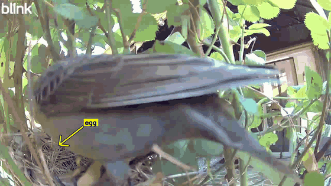
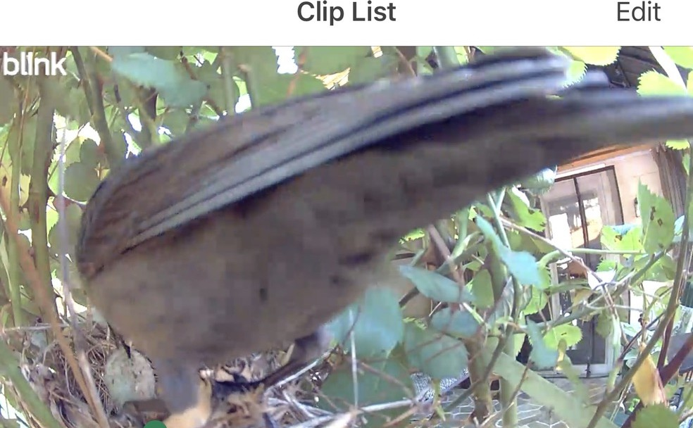

# Cardinal Nest Monitor

> [!NOTE]
> ### 🥚 Nest Status: **Eggs incubating**
> Mom is on the nest. System is watching 24/7. *I'll update this page as they hatch and fledge.*

## Timeline

- **Apr 13** — Egg laying
- **Apr 14 – 23** — Incubation (currently day ~10 of ~12)
- **Apr 25 – 27** — Expected hatch



The female cardinal chose the rose bush by the back door. It was a terrible location, strategically speaking: low to the ground, close to foot traffic, visible from the kitchen window. But she was not consulting anyone. She built the nest in three days, a tight cup of twigs and grass wedged into the thorns, and by the second week of April there were eggs in it.

I know this because of the camera. A Blink Outdoor, mounted to the siding, pointed at the bush. It was there to keep an eye on Lady, my dog, when I let her out back. The cardinal repurposed it.

The Brown Thrasher came twice. The first time, it landed on the bush, looked around, and left. Reconnaissance. The second time, it landed on the rim of the nest, reached in with its beak, and left with an egg. The whole thing took about four seconds. I was inside the house, ten feet away, making coffee.

I found the footage that evening. I watched it several times.

Then I started writing code.

The system was live within a few days. Almost immediately, it created a different kind of panic. The cardinal was not on the nest at night. The camera showed an empty cup, hour after hour, from dusk until morning. The eggs were sitting in the open air, uncovered, cooling. I was convinced they were done for.

It took some reading to understand what was happening. Female cardinals lay one egg per day over three to four days. During the laying phase, they do not incubate. They visit the nest briefly to lay, then leave. Full incubation, the patient sitting that lasts eleven to thirteen days, only begins after the last egg is down. The cardinal was not neglecting her eggs. She was not finished laying them yet.

The system did not know this. It fired absence alerts all night, every night, for the first four days. I had built a machine to protect eggs from a thrasher, and the first thing it did was convince me the mother had abandoned them.

So I taught it what a cardinal's spring actually looks like. The system now tracks six stages, from nest building through laying and incubation and feeding all the way to the day the chicks fledge. The stage that mattered most was the laying one. Once the system knows she is still laying, it understands that an empty cup at three in the morning is the female cardinal doing exactly what she is supposed to be doing, and it stops paging me about it.

The status badge at the top of this page updates as she moves through these stages.

## What the system sees

The camera takes a fresh photo on a schedule that adapts to what's happening. Five minutes when she's on the nest. One minute when she's away. Thirty seconds for the first three minutes after she leaves, when the predation risk is highest. Thirty minutes overnight, when she sleeps on the eggs. Each image goes to Claude Sonnet 4.6, Anthropic's vision model, which returns a structured observation: is the cardinal present, are the eggs visible, is anything threatening near the nest.

Most of the time, the answer is boring.

### Mom is home


*She's on the nest. The system notes this, confirms her presence, and checks back in five minutes. No alert. This is the good outcome, repeated two hundred times a day.*

### Something is at the nest



*A thrasher. The system identifies it by the long tail, the streaked breast, the absence of a crest. It fires a HIGH alert to my phone immediately. Before the notification arrives, a second model, Claude Opus 4.7, reviews the same image cold, with no knowledge of the first model's verdict. If Opus disagrees, the alert is suppressed. If Opus agrees, it goes through. This one went through.*

### Mom is gone


*The nest is empty. She left to forage, probably. The system tightens the snap cadence from every five minutes to every sixty seconds. This is the predation risk window. If a threat shows up during this window, the alert fires instantly. If nothing happens but she's still gone after five minutes, a MEDIUM alert lets me know.*

## What happens when something goes wrong

| Level | What the system saw | What I should do |
|---|---|---|
| **CRITICAL** | A predator's beak or body inside the nest cup | **The backyard is the production environment and you just got paged** |
| **HIGH** | A thrasher, blue jay, or squirrel near the nest | Pull up the camera. Decide whether to go outside. |
| **MEDIUM** | The cardinal has been gone for five minutes or more | Probably fine. Probably. The system is watching closer now. |
| **LOW** | She came back | Stand down. |

## How it works

There are two services running on a computer that stays on all day. The first one does nothing but take photos and save them to disk. The second one does everything else: analyze the image, decide if it's a threat, check with a second model if it is, post to Discord, log the observation, update the state.

They are separate on purpose. On April 15, 2026, a stuck API call froze the entire system for three hours during peak daylight. No photos, no alerts, nothing. The eggs were unmonitored while the sun was out and the thrashers were active. Splitting the services means the camera never stops taking pictures, even if the analysis side crashes, restarts, or runs out of credits. When the analyzer comes back, it works through whatever piled up while it was gone.

```
┌──────────────────────────┐          ┌──────────────────────────────┐
│  DOWNLOADER              │          │  ANALYZER                    │
│                          │          │                              │
│  Blink camera            │  spool   │  Claude Sonnet 4.6           │
│    adaptive cadence      ├────────→ │    species ID + threat eval  │
│    30s / 1m / 5m / 30m   │          │    Opus 4.7 verification     │
│                          │          │    Discord alerts            │
│  Never stops.            │          │    feed + analytics          │
│  Not even during         │          │                              │
│  code deploys.           │          │  Can restart without         │
│                          │          │  losing a single snap.       │
└──────────────────────────┘          └──────────────────────────────┘
```

The cadence adapts to the situation. When she's on the nest, a photo every five minutes is enough. When she's away foraging, the interval drops to sixty seconds. Overnight, when cardinals sleep on their eggs, it relaxes to every thirty minutes.

### The night vision problem

The camera switches to infrared after dark. The images turn grayscale. And in grayscale, the cardinal's brown plumage becomes indistinguishable from the nest straw. The AI kept reporting "nest empty" at moderate confidence because it genuinely could not tell the difference between a bird and the material she was sitting on.

The result was ten to fifteen false "mom is gone" alerts every night. She was there the whole time, sleeping on her eggs, invisible to infrared.

The fix had three parts. First, I added explicit IR guidance to the prompt: if the image is grayscale, default to "uncertain" rather than "absent," because you cannot reliably tell. Second, I suppressed the absence alerts entirely during quiet hours, because a cardinal leaving her nest at 2 AM to forage is not a real scenario. Third, I raised the confidence threshold for overnight state changes, so a low confidence "empty nest" reading from an IR image would not trigger the system to start snapping every sixty seconds and burning through camera battery for nothing.

That was almost right. The camera switches to infrared at sunset, but the quiet hours window did not start until eleven at night. For three hours in the evening the system was in the blind spot it had been designed to handle, and it fired the same false alert the overnight fix was supposed to prevent. I changed the suppression to key off the model's own description instead of the wall clock. When Sonnet says the image is in IR or infrared or grayscale, the system treats it the same way it treats the middle of the night.

The predator alerts still fire overnight. A raccoon at the nest at 3 AM is a real threat and the system needs to catch it. But the "where is mom" logic learned to admit what it cannot see.

### Catching a four-second attack

A thrasher raid takes about four seconds. Beak in the cup, grab, gone. I watched the original footage several times and realized the sixty-second snap cadence could miss the whole thing. The bird would come and go between frames.

I changed two things.

First, **burst cadence**. For the first three minutes after the cardinal leaves her nest, the system snaps every thirty seconds instead of every sixty. Three minutes is when the risk is highest, when a thrasher watching from a nearby tree is most likely to make its move. After those three minutes the cadence relaxes back to sixty seconds until she returns.

```
Before:   leave ── 60s ── 60s ── 60s ── 60s ── 60s ── 60s ── return
After:    leave ─30s─30s─30s─30s─30s─30s ── 60s ── 60s ── 60s ── return
          │──── burst (first 3 min) ────│──── normal absence ────│
```

Second, **multi-image analysis**. Each snap now goes to the analyzer as three crops of the same frame: the full view, a tight center crop that makes the nest cup fill the model's attention, and a smaller overview for scene context. The old approach sent one downscaled image, which worked fine when a thrasher was obviously perched on top of the bush but struggled when it mattered, when a beak was half-visible behind a leaf or the distinguishing streaks on its breast were a few pixels wide.

Together these changes compound. The system gets more chances to see an attack happening, and each chance has more detail to work with. The thrasher has to slip past both to succeed.

### Tracking the lifecycle

The early version of the system had no concept of time. A snap was a snap. Was she on the nest, or wasn't she. A predator was either there or not. The state machine had two states and they flickered.

That was enough for the first job, which was catching a thrasher at the cup. It was not enough for everything else. The system did not know that a cardinal at the very beginning of nesting season visits her cup once a day for ten seconds and then leaves for fourteen hours, and that this is normal, and that the alarm it kept firing was wrong. It did not know that a cardinal in the middle of incubation almost never leaves the nest, and that any extended absence late in May would mean something has gone wrong.

So I gave it a calendar.

The system now tracks six stages in order: building the nest, laying eggs, incubating them, feeding chicks, fledging, then empty. The transitions are inferred from observation, not declared by hand. When twenty four hours of snaps show her sitting roughly seven times out of ten, the system concludes incubation has begun. When a chick's open mouth appears above the rim of the cup on two separate frames within a four hour window, it moves to feeding. When she stops visiting the nest for most of a day, with no predator seen anywhere nearby in the previous two days, it calls it a fledge.

The two-sighting rule for hatching is deliberate. The analyzer occasionally misreads a shadow or a clump of straw as a hatchling, and a single noisy frame should not move the calendar forward. Two confirming frames within four hours is the threshold I settled on. It costs me a few minutes of latency on the actual hatch announcement and it costs me nothing at all in false alarms.

Each transition gets a quiet note in a dedicated Discord channel, separate from the alerts. The egg-laying announcement, the incubation announcement, the hatch announcement, the fledge announcement: short, gentle, one line each. They share a channel because they share a tone. None of them ever require action.

The daily heartbeat now includes a day counter. "Incubation, Day 4 of about 12." It tells me where we are without my having to count it out.

When I started monitoring this brood the cardinal was already past the building stage and partway through laying. A small backfill tool walks the observation history and infers when each transition happened, so the day counter starts from a real date instead of from when I happened to install the camera. For this brood it set incubation as having started on April 14th.

### Two model verification

Claude Sonnet 4.6 analyzes every snap. When it flags a CRITICAL or HIGH alert, the system runs a blind second opinion through Opus 4.7. Same image, same prompt, no hint of what Sonnet said. This is not confirmation bias; it is an independent evaluation. Opus can suppress, downgrade, or confirm.

The female cardinal and the Brown Thrasher are both brownish birds. The analyzer prompt includes field marks: red crest means cardinal, never a threat; long tail plus streaked breast plus yellow eye means thrasher, always a threat; can't tell means unknown, which still fires an alert, because I would rather get woken up for nothing than miss the real thing.

### Five Discord channels

| Channel | Purpose |
|---|---|
| **#alerts** | CRITICAL, HIGH, MEDIUM, LOW. Actionable, live alerts only |
| **#nest-feed** | Every snap with Claude's full analysis. Watch the AI reason in real time |
| **#nest-analytics** | Behavior reports every 8 hours: foraging trips, threat counts, time on nest |
| **#nest-backfill** | Alerts from analyzer downtime, tagged `[BACKFILL +Nm]`. Keeps #alerts clean |
| **#cardinal-lifecycle-changes** | Stage transitions only: laying begins, incubation begins, hatch, fledge. Celebration only, never an alarm |

## By the numbers

| | |
|---|---|
| Snaps per day | ~285 |
| Monthly cost (Anthropic) | ~$180-270 (multi-image on) |
| Camera battery life | 10 to 14 days |
| Lifecycle stages tracked | 6 |
| Tests in the suite | 192 |
| Reaction time in the burst window (first 3 min after she leaves) | Under 30 seconds |
| Reaction time when she's away (after burst) | Under a minute |
| Reaction time when she's home | Under five minutes |
| Models that know the cardinal exists | 2 |
| Cardinals that know the models exist | 0 |

## Setup

### Prerequisites

- macOS with Python 3.11+
- [Blink Outdoor](https://blinkforhome.com/) camera pointed at the nest
- [Anthropic API key](https://console.anthropic.com/) with Sonnet 4.6 + Opus 4.7 access
- Discord server with webhook URLs for up to 5 channels (alerts is required, the other four are optional but recommended). One additional webhook for a dedicated test channel if you plan to run the integration suite

### Install

```bash
git clone https://github.com/bali0019/birdnest-ai.git
cd birdnest-ai
python3.11 -m venv venv
source venv/bin/activate
pip install -e ".[dev]"
```

### Configure

```bash
cp .env.example .env
# Fill in: ANTHROPIC_API_KEY, DISCORD_WEBHOOK_URL, BLINK_USERNAME,
# BLINK_PASSWORD, BLINK_CAMERA_NAME. Optional: feed, analytics,
# and backfill webhook URLs.
```

### Blink authentication (one time)

```bash
python -m cardinal_nest_monitor --auth-only
# Check email for the 2FA PIN, enter it when prompted.
# Saves blink_credentials.json. No re-auth needed until token expires (~yearly).
```

### Deploy

```bash
mkdir -p ~/Library/Logs/cardinal-nest-monitor

# Install and start both services
cp launchd/com.cardinalnest.downloader.plist ~/Library/LaunchAgents/
cp launchd/com.cardinalnest.analyzer.plist ~/Library/LaunchAgents/
launchctl bootstrap gui/$(id -u) ~/Library/LaunchAgents/com.cardinalnest.downloader.plist
launchctl bootstrap gui/$(id -u) ~/Library/LaunchAgents/com.cardinalnest.analyzer.plist

# Verify both are running
launchctl list | grep cardinalnest
```

### Run the tests

```bash
source venv/bin/activate
TEST_MODE=true python -m pytest tests/ -v
# 192 tests. All must pass before deploying any change.
```

## Running it locally

The two LaunchAgent services are the production deploy. For development you can run the same code in the foreground:

```bash
source venv/bin/activate

# Combined: both downloader and analyzer in one process. Easiest for dev.
python -m cardinal_nest_monitor --role combined

# Or run them separately, the way the launchd plists do:
python -m cardinal_nest_monitor --role downloader   # in one terminal
python -m cardinal_nest_monitor --role analyzer     # in another
```

Ctrl+C shuts down cleanly. The downloader will keep writing to the spool, the analyzer will keep draining it; they coordinate through `data/state.sqlite` in WAL mode.

## Useful commands

```bash
# Smoke test the Discord webhook
python -m cardinal_nest_monitor.tools.test_discord

# Run the full pipeline against a single local JPEG, no live camera needed.
# Useful when iterating on the analyzer prompt.
python -m cardinal_nest_monitor.tools.dryrun --image evidence/reference/historical_thrasher_1.jpg

# Pause snap capture before walking near the nest. Cleared automatically.
python -m cardinal_nest_monitor.tools.pause 10        # pause for 10 minutes
python -m cardinal_nest_monitor.tools.pause --clear   # resume now

# Fire a single behavior analytics report on demand
python -m cardinal_nest_monitor.tools.analytics_once

# Backfill lifecycle timestamps from observation history
python -m cardinal_nest_monitor.tools.lifecycle_backfill --auto --dry-run
python -m cardinal_nest_monitor.tools.lifecycle_backfill --auto

# Real-image regression suite for analyzer prompt changes (~$0.40 per run)
python -m cardinal_nest_monitor.tools.lifecycle_regression
```

## Testing safely

The integration suite posts real Discord embeds. To keep the live alert channels clean during test runs, route every test post to a dedicated test channel:

```bash
# In .env, alongside the production webhooks:
DISCORD_TEST_WEBHOOK_URL=https://discord.com/api/webhooks/.../...

# Then:
TEST_MODE=true python -m pytest tests/ -v
```

When `TEST_MODE=true`, the autouse fixture in `tests/integration/conftest.py` rewrites `discord_webhook_url`, `discord_feed_webhook_url`, and `discord_analytics_webhook_url` to point at the test webhook for the duration of every test. Every test embed is also prefixed with `[TEST]` and footed with the run timestamp so it's visually distinct in Discord. If `DISCORD_TEST_WEBHOOK_URL` is unset, the integration tests fail with a clear error rather than risk leaking into production channels.

## Logs and operations

```bash
# Tail the live logs (separate per service)
tail -F ~/Library/Logs/cardinal-nest-monitor/downloader.out.log
tail -F ~/Library/Logs/cardinal-nest-monitor/analyzer.out.log

# Restart just the analyzer (most code changes only need this)
launchctl kickstart -k gui/$(id -u)/com.cardinalnest.analyzer

# Restart just the downloader (rare; only when blink_client.py changes)
launchctl kickstart -k gui/$(id -u)/com.cardinalnest.downloader

# Inspect the current state row
sqlite3 data/state.sqlite "SELECT * FROM state WHERE id = 1;"

# Recent alerts
sqlite3 data/state.sqlite "SELECT ts, severity, rule_id, species, title FROM alerts ORDER BY ts DESC LIMIT 10;"
```

## Config that matters

Most of the `.env` is set-and-forget. The handful that change the shape of the system:

| Variable | What it does |
|---|---|
| `LIFECYCLE_TRACKING_ENABLED` | Default `true`. Set `false` as an escape hatch if a lifecycle false-positive ever fires; no code deploy needed |
| `VERIFY_ALERTS_WITH_OPUS` | Default `true`. Blind Opus 4.7 second opinion on every CRITICAL/HIGH. ~$0.05 per verified alert. Disable to fall back to single-pass alerting |
| `DISCORD_LIFECYCLE_WEBHOOK_URL` | Routes 🥚/🪺/🐣/🦅 transition alerts to a dedicated celebration channel. Empty = lifecycle alerts go to the urgent channel |
| `DISCORD_BACKFILL_WEBHOOK_URL` | Routes alerts on stale snaps (analyzer-recovery backlog) to a separate channel tagged `[BACKFILL +Nm]`. Empty = backfill alerts are suppressed entirely |
| `DISCORD_TEST_WEBHOOK_URL` | Required for the integration test suite. Every `[TEST]` embed routes here so production channels stay clean |
| `MULTI_IMAGE_ANALYSIS` | Default `true`. Sends three crops per snap (full + center-zoom + overview) for better recall on subtle thrasher features. Disable to halve Anthropic spend at the cost of recall |
| `ENABLE_EGG_COUNT_ALERTS` | Default `false` on this camera. Turns on the CRITICAL egg-count-dropped rule. Off because this camera cannot reliably see into the cup from below/behind. Flip to `true` only if you install a top-down camera with a clear view of the eggs |

See [`.env.example`](./.env.example) for the full list with documentation.

**Privacy considerations.** The Discord feed channel receives every snap with the camera image attached; keep channel invites private — anyone with access sees the whole stream.

**Reproducible installs.** For CI or production deploys, `pip install -r requirements.lock` pins every transitive dependency to the exact version in the committed lockfile. For dev work, `pip install -e .[dev]` is still the path — see CLAUDE.md §30 for the rotation cadence.

## Tech stack

Python 3.11 and asyncio. Claude Sonnet 4.6 for primary analysis on every snap. Claude Opus 4.7 for blind verification on threats. blinkpy 0.25.5 for the Blink camera API. SQLite in WAL mode for state persistence and cross-process coordination. Discord webhooks for alert delivery with attached photos, on five separate channels. Two macOS LaunchAgents managed by launchd. pydantic for schema validation. 192 tests in pytest, including integration tests that post to a dedicated test Discord channel so the real alert channels stay clean.

## Project structure

```
src/cardinal_nest_monitor/
  analyzer.py          Sonnet 4.6 vision analysis with species ID prompt
  verifier.py          Opus 4.7 blind second opinion on threats
  events.py            Rules engine (severity levels, cooldowns, absence tracking)
  state.py             SQLite state (observations, alerts, derived nest state)
  notifier.py          Discord webhooks (5 channels, severity colored embeds)
  spool.py             Atomic rename file queue between services
  downloader_loop.py   Blink to spool producer
  analyzer_loop.py     Spool to pipeline consumer
  main.py              Pipeline wiring + watchdog + schedulers + lifecycle day counter
  analytics.py         Foraging trip detection + behavior reports
  config.py            pydantic settings (.env)
  schema.py            Pydantic models (NestObservation, Severity, AlertDecision)
  blink_client.py      Blink camera connect, snap, motion
  evidence.py          Per event evidence directory writer
  tools/
    lifecycle_backfill.py    One shot tool to infer historical lifecycle timestamps
    lifecycle_regression.py  Real image regression suite for analyzer prompt changes
    analytics_once.py        Fire a single analytics report on demand
    dryrun.py                Run the full pipeline against a local JPEG
    pause.py                 Pause snaps before walking near the nest
    test_discord.py          Webhook smoke test

launchd/               macOS LaunchAgent plists
tests/                 192 tests (unit + integration)
evidence/reference/    Curated regression images for species ID validation
```

##

The cardinal doesn't know about any of this. She just sits on her eggs.

<p align="center">
  <i>Built with <a href="https://claude.ai/code">Claude Code</a></i>
</p>
